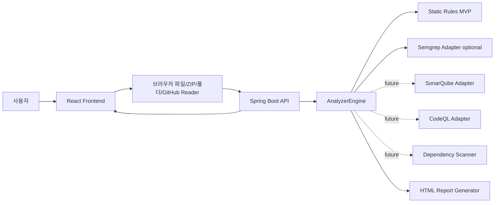

# 취약했네

AI 기반 시큐어코딩 건강검진 서비스  
**"당신의 코드는... 취약했네."**

취약했네는 사용자가 코드나 프로젝트를 업로드하면 보안 취약점을 분석하고, 건강검진 결과처럼 점수와 판정을 시각화하는 포트폴리오용 SAST MVP입니다. 실제 기업용 정적 분석 서비스의 흐름을 따라가되, 개발자가 겁먹기보다 "내 코드 건강 상태를 확인했다"는 느낌을 받도록 한국식 브랜딩과 건강검진 UX를 적용했습니다.

## 주요 기능

- 코드 직접 입력 분석
- 붙여넣기 코드 언어 자동 추론(Java, JavaScript, TypeScript, Python, PHP, SQL)
- 단일 파일 업로드 분석
- ZIP 업로드 후 재귀 탐색 분석
- 프로젝트 폴더 전체 업로드 및 드래그앤드롭 분석
- 공개 GitHub 저장소 URL 분석 MVP
- Java, Spring, JavaScript, TypeScript, Python, PHP, SQL, Dockerfile, 설정/의존성 파일 필터링
- HIGH / MEDIUM / LOW 취약점 분류
- 프로젝트 전체 보안 점수와 건강 판정
- 파일별 취약점 개수와 취약 파일 TOP5
- 프로젝트 구조 트리와 취약 파일 표시
- 최근 검사 이력과 점수 변화
- HTML 보안 진단서 생성

## 기술 선택 이유

### Frontend

- **React + TypeScript**: 복잡한 검사 상태와 결과 타입을 안정적으로 관리하기 위해 선택했습니다.
- **TailwindCSS**: Apple Health, Notion, Linear, Vercel Dashboard 느낌의 미니멀 UI를 빠르게 구성하기 위해 사용했습니다.
- **Zustand**: 업로드 상태, 검사 결과, 최근 이력처럼 전역이지만 무겁지 않은 상태를 간결하게 관리합니다.
- **React Query**: 분석 요청의 loading/error/success 흐름을 명확하게 다루고, 향후 비동기 job polling 구조로 확장하기 좋습니다.
- **JSZip + GitHub API**: 브라우저에서 ZIP을 풀고, 공개 GitHub 저장소는 GitHub API와 raw 파일 fetch로 프로젝트 단위 분석 요청을 만들 수 있습니다.

### Backend

- **Spring Boot**: REST API, multipart upload, 검증, CORS, 추후 인증/JWT 확장에 적합합니다.
- **분석 엔진 분리 구조**: `AnalyzerEngine` 인터페이스를 중심으로 현재 룰 기반 엔진과 미래 외부 SAST 어댑터를 분리했습니다.
- **TiDB 예정**: 검사 이력과 프로젝트별 점수 추이를 MySQL 호환 분산 DB에 저장할 수 있도록 API 응답 구조를 프로젝트 단위로 설계했습니다.

## 아키텍처



무료 배포 계획은 `docs/free-deployment-plan.md`에 정리했습니다. 현재 추천 조합은 프론트엔드 Cloudflare Pages 또는 Vercel, 백엔드 Render Free Web Service, 초기 DB 없음입니다.

## 프로젝트 구조

```text
frontend/
  src/
    components/
    hooks/
    lib/
    pages/
    store/
    types/

backend/
  src/main/java/com/chwiyakhaenne/
    api/
    analyzer/
      external/
      port/
      rules/
    model/
    report/
  analyzer/
  api/
  report/
  rules/
    kisa_js_rules.json
    secure_coding_rules.json
    sql_injection.py
    xss.py
    secret_key.py
    command_injection.py

tests/
  samples/
    positive/
    negative/
    additional/
  test_kisa_js_rules.py
  test_project_qa_scenarios.py
  test_realistic_vulnerable_flows.py
  test_benchmark_detection_metrics.py
  test_semgrep_cli_smoke.py
  test_secure_coding_catalog.py
  catalog_security_metrics.py
  benchmark_security_metrics.py
  semgrep_cli_smoke.py
```

## KISA JavaScript 룰셋

KISA JavaScript 시큐어코딩 가이드 2023년 개정본을 기준으로 JS 1차 룰셋과 검증 샘플을 분리했습니다.

- 룰 정의: `backend/rules/kisa_js_rules.json`
- 룰 러너: `backend/analyzer/kisa_js_analyzer.py`
- 매핑 문서: `docs/kisa-js-rule-mapping.md`
- Positive 샘플: `tests/samples/positive/`
- Negative 샘플: `tests/samples/negative/`

현재 구현 지표는 curated 샘플셋 기준입니다.

| 항목 | 값 |
| --- | --- |
| 현재 구현 룰 수 | 32개 |
| OWASP 추가 룰 수 | 11개 |
| KISA 전체 항목 대비 커버리지 | 32 / 42 = 76.19% |
| 테스트 샘플 수 | 86개 (KISA 64, OWASP 추가 22) |
| KISA Detection Count | 32 |
| KISA 탐지율(Recall) | 100% |
| KISA 정밀도(Precision) | 100% |
| KISA 오탐률(False Positive Rate) | 0% |
| KISA 미탐률(False Negative Rate) | 0% |
| OWASP 추가 샘플 검증 | positive 11/11, negative 11/11 |

검증 실행:

```bash
python3 -m pip install -r requirements-dev.txt
python3 tests/kisa_js_metrics.py
python3 -m pytest tests/test_kisa_js_rules.py
```

한계점:

- 현재 수치는 직접 작성한 positive/negative 샘플셋 기준이며 실제 제품 수준 탐지율이 아닙니다.
- 엔진은 Regex와 간단한 AST 신호(call/member/assignment)를 혼합한 MVP입니다.
- 데이터플로우, taint tracking, 프레임워크별 미들웨어 흐름, 타입 정보는 아직 제한적입니다.
- Semgrep, CodeQL, SonarQube 연동 시 동일 Rule ID를 유지하고 detector만 교체할 예정입니다.

OWASP 추가 룰은 Prototype Pollution, ReDoS, Insecure CORS, TLS 인증서 검증 비활성화, CSRF 보호 없는 상태 변경 라우트, NoSQL Injection, JWT 검증 우회, Mass Assignment, URL 민감정보 노출, postMessage 와일드카드, Server-Side Template Injection을 포함합니다.

## 다언어 보안 룰 카탈로그

사용자가 제공한 Java, Python, PHP, Node.js/TypeScript, React, SQL, Generic 룰을 `backend/rules/secure_coding_rules.json`에 반영했고, Spring/Django/Node/PHP/Infra 설정 취약점까지 확장했습니다. Spring Boot 분석 엔진은 `CatalogSecurityRule`을 통해 이 JSON 카탈로그를 로드하므로, 이후 Semgrep/CodeQL/SonarQube 결과도 동일한 Rule ID 체계로 매핑할 수 있습니다.

| 항목 | 값 |
| --- | --- |
| 다언어 카탈로그 룰 수 | 123개 |
| 활성 룰 총합 | 166개 (KISA JS 32, OWASP JS 11, 다언어 123) |
| 다언어 Positive 샘플 | 123개 |
| 다언어 Negative 샘플 | 123개 |
| 전체 샘플 검증 수 | 332개 |
| 다언어 Detection Count | 123 |
| 다언어 Recall | 100% |
| 다언어 Precision | 100% |
| 다언어 오탐률 | 0% |
| 다언어 미탐률 | 0% |
| 변형 샘플 QA | positive 28/28 탐지, negative 13/13 미탐지 |
| 혼합 문맥 정밀 QA | mixed 11/11 탐지, safe 프로젝트 finding 0 |
| 프로젝트형 QA | 취약 미니 프로젝트 기대 룰 37/37 탐지, 안전 프로젝트 핵심 룰 오탐 0 |
| 현실형 취약 QA | Node/React, Spring, Flask, PHP, Infra 5개 시나리오 기대 룰 98/98 탐지 |
| 실무형 폴더 QA | 고유 기대 룰 97/97 탐지, 파일 요약 17개, 취약 파일 14개, 안전 파일 3개 finding 0 |
| 라벨링 benchmark QA | 10개 케이스, expected label 57/57 탐지, forbidden label 0/57 오탐 |
| 브라우저 취약 붙여넣기 QA | Node/React 27건, Flask 17건, PHP 10건, 신규 JWT/cookie 혼합 샘플 10/10 탐지, 콘솔 오류 0 |

검증 실행:

```bash
python3 -m pytest
python3 tests/catalog_security_metrics.py
python3 tests/benchmark_security_metrics.py
```

추가 카탈로그는 Spring Security CSRF/CORS/TLS/permitAll, 세션 고정 보호 비활성화, Actuator/H2 노출, Java/Python/PHP/Node SSRF와 경로 조작, Spring SpEL/JNDI, JWT 검증 우회, GraphQL introspection 노출, Celery pickle serializer, multer 업로드 제한 누락, Django 운영 설정, Node JWT/cookie 플래그, React 링크 보안, SQL 권한/파일 연산, Docker/Kubernetes 설정, Terraform IAM/네트워크 설정, GitHub Actions 공급망/secret 로그 노출, 의존성 HTTP 소스까지 포함합니다.

주의: 위 수치는 직접 작성한 curated 샘플셋, 변형 샘플, 혼합 문맥 QA, 직접 라벨링한 realistic benchmark 기준입니다. 오픈소스 취약 프로젝트나 OWASP Benchmark 같은 독립 검증셋 기준 제품 검증률은 별도로 분리 산정해야 합니다.

## 외부 SAST 연동 구조

`ExternalAnalyzerPort`를 통해 외부 분석기를 정적 룰 엔진 뒤에 붙일 수 있게 분리했습니다. 현재 `SemgrepExternalAnalyzer` 1차 어댑터가 구현되어 있으며 기본값은 비활성화입니다.

| 설정 | 기본값 | 설명 |
| --- | --- | --- |
| `chwiyakhaenne.semgrep.enabled` | `false` | Semgrep 실행 여부 |
| `chwiyakhaenne.semgrep.command` | `semgrep` | 로컬 Semgrep 실행 파일 |
| `chwiyakhaenne.semgrep.config` | `p/owasp-top-ten` | Semgrep config |

Semgrep 결과는 가능한 경우 기존 `JAVA_*`, `NODE_*`, `PY_*`, `GEN_*` Rule ID로 매핑하고, 매핑이 없으면 `SEMGREP:<check_id>` 형태로 보존합니다. 이번 단계에서는 어댑터 컴파일과 Spring 엔진 결합을 검증했고, 로컬 Semgrep rule 기반 CLI smoke test도 추가했습니다. 현재 개발 환경에는 Semgrep CLI가 없어 `test_semgrep_cli_smoke.py`는 skip되며, Semgrep이 설치된 환경에서는 `NODE_SQLI_001`, `NODE_CMDI_001` 매핑을 실제 CLI 출력으로 검증합니다.

Semgrep smoke 실행:

```bash
python3 tests/semgrep_cli_smoke.py
```

## 점검 항목

| 심각도 | 항목 |
| --- | --- |
| HIGH | SQL Injection, Command Injection, 인증/인가 누락, 위험 API 사용, 하드코딩된 비밀번호 |
| MEDIUM | XSS, 파일 업로드 취약점, 민감정보 로그 출력, JWT 검증 누락 |
| LOW | Deprecated 함수, 디버그 코드 잔존, 예외처리 부족 |

## 보안 점수 기준

| 점수 | 판정 |
| --- | --- |
| 90~100 | 건강함 |
| 70~89 | 관리 필요 |
| 40~69 | 많이 취약했네 |
| 0~39 | 입원 권장 |

감점 기준은 HIGH 12점, MEDIUM 6점, LOW 2점입니다.

## 문제 해결 과정

1. 단일 파일 검사기가 아니라 프로젝트 전체 건강검진처럼 느껴지도록 업로드 흐름을 먼저 설계했습니다.
2. 폴더 업로드와 ZIP 업로드를 프론트에서 처리해 서버는 일관된 `files[]` JSON을 분석하게 만들었습니다.
3. 붙여넣기 코드는 확장자가 없으므로 내용 기반으로 언어와 임시 파일명을 추론해 JS-KISA 룰셋이 실제 입력 흐름에서도 동작하게 했습니다.
4. 백엔드는 `AnalyzerEngine`과 `ExternalAnalyzerPort`를 분리해 MVP 정규식 룰과 외부 SAST 도구가 공존할 수 있게 했습니다.
5. 분석 결과는 파일별 summary, TOP5, tree, finding, HTML report를 한 번에 내려주도록 구성했습니다.
6. UI는 흰색 기반, 연회색 표면, 부드러운 그림자, 건강 점수 게이지 중심으로 개발툴보다 건강검진 앱에 가깝게 만들었습니다.
7. 결과 화면에 활성 룰 수, 샘플 검증 수, KISA 커버리지, 다언어 탐지 수를 노출해 사용자가 결과의 근거를 바로 확인하도록 개선했습니다.
8. safe pattern이 파일 전체 취약 탐지를 가리는 문제를 줄이기 위해 매칭 근거 단위 safe 판정과 혼합 문맥 QA를 추가했습니다.
9. 실제 QA 중 발견한 Python parameterized SQL 오탐, `escape-html` sanitizer 오탐, 새 분석 후 필터 잔존 UX를 회귀 테스트와 함께 보정했습니다.
10. 안전 코드만 보는 인상을 줄이기 위해 실제 서비스형 취약 코드 묶음 5개를 별도 QA로 추가하고, API와 브라우저에서 반복 검증했습니다.
11. 결과 화면을 수정 우선순위 보드로 고도화해 파일별 drill-down, 우선순위 정렬, KISA/OWASP/다언어 룰 필터, 탐지 근거와 “왜 탐지됐나” 설명을 한 화면에 연결했습니다.
12. 공개 GitHub 저장소 URL을 GitHub API/raw 파일 reader로 읽어 기존 프로젝트 분석 흐름으로 넘기는 MVP를 추가했습니다.
13. 진단 완료 후 결과 대시보드로 자동 이동하고 결과 요약/감점/우선 조치가 바로 보이도록 완료 애니메이션과 하이라이트를 보강했습니다.
14. finding 상세에 전후 라인 컨텍스트를 추가해 실제 탐지 라인과 주변 코드를 함께 확인할 수 있게 했습니다.
15. 결과 화면에 검증률 패널과 Semgrep 외부 분석기 상태를 추가해 현재 룰셋 신뢰도와 외부 SAST 연결 여부를 분리해 보여줍니다.
16. ZIP/폴더/GitHub 업로드 시 전체 파일, 분석 포함 파일, 제외 파일 수를 표시해 프로젝트 업로드가 왜 실패했는지 추적할 수 있게 했습니다.
17. HTML 진단서 미리보기와 브라우저 인쇄 기반 PDF 출력 버튼을 추가했습니다.

## 한계점

- 현재 분석은 정규식 기반 휴리스틱이라 false positive/false negative가 발생할 수 있습니다.
- GitHub URL 분석은 공개 저장소 API 기반 MVP이며, private repository 인증, clone 기반 분석, PR 코멘트는 아직 없습니다.
- 검사 이력은 프론트 localStorage에 저장되며, 사용자별 DB 저장은 TiDB 연동 후 구현 예정입니다.
- PDF 리포트는 브라우저 인쇄 기반 저장을 지원하며, 서버 사이드 PDF 생성과 템플릿 버전 관리는 아직 없습니다.
- 대용량 프로젝트는 MVP 수준의 비동기 요청 상태만 제공하며, job queue와 polling은 향후 작업입니다.
- 현재 Precision/Recall 100%는 curated 샘플과 직접 라벨링한 benchmark 기준이며 독립 오픈소스 프로젝트 검증률은 아닙니다.
- 붙여넣기 언어 추론은 보강했지만, 사용자가 직접 언어를 선택하는 UX는 아직 없습니다.
- Semgrep 어댑터 구조와 CLI smoke test는 구현됐지만, 로컬 Semgrep CLI 설치와 독립 벤치마크 기반 지표 산정은 아직 남아 있습니다.

## 향후 개선 방향

- TiDB 기반 사용자별 검사 이력 저장
- Redis job queue와 비동기 분석 polling
- Docker Compose 개발 환경
- JWT 인증과 프로젝트별 권한 관리
- Semgrep CLI 실측 QA, SonarQube, CodeQL 연동
- OWASP Dependency Check, Snyk 기반 의존성 취약점 분석
- GitHub private repository 인증, clone 기반 분석, PR 코멘트
- 서버 사이드 PDF 생성, 공유 링크, 진단서 템플릿 버전 관리

사용자 만족도 관점의 QA와 다음 작업 우선순위는 `docs/ux-qa-next-plan.md`에 정리했습니다.

## 실행 방법

### Backend

```bash
cd backend
JAVA_HOME=/Library/Java/JavaVirtualMachines/microsoft-17.jdk/Contents/Home mvn spring-boot:run
```

백엔드는 `http://localhost:8080`에서 실행됩니다.

### Frontend

```bash
cd frontend
npm install
npm run dev
```

프론트엔드는 `http://localhost:5174`에서 실행됩니다. 이미 5174 포트를 사용 중이면 Vite가 안내하는 대체 포트를 사용하세요.

## API 예시

```bash
curl -X POST http://localhost:8080/api/analyze \
  -H "Content-Type: application/json" \
  -d '{
    "projectName": "demo",
    "files": [
      {
        "path": "UserController.java",
        "language": "Java",
        "content": "statement.executeQuery(\"SELECT * FROM users WHERE id=\" + id);"
      }
    ]
  }'
```

## 스크린샷 위치

스크린샷은 `docs/screenshots/`에 저장합니다.

- `docs/screenshots/dashboard.png`
